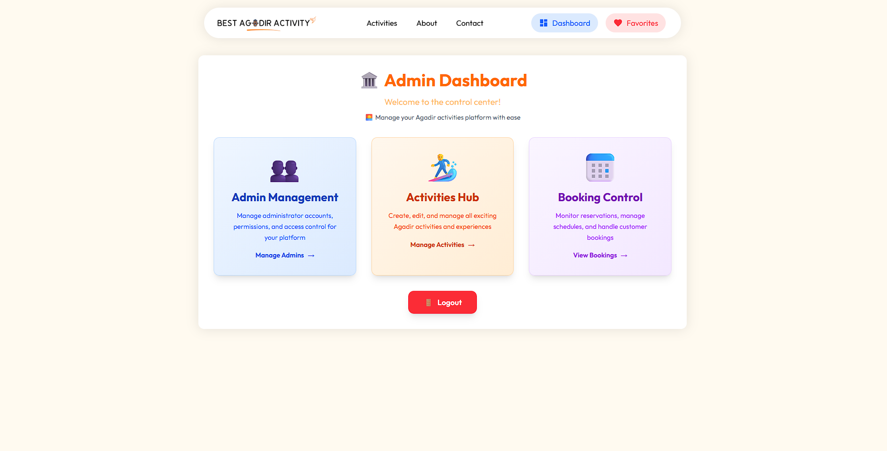

# Best Agadir Activities

A Laravel-based web application for discovering and booking exciting activities in Agadir, Morocco.

### Home Page

## Features

### 🏖️ Activity Discovery
- Browse a curated collection of activities in Agadir
- Featured activity slider showcasing popular experiences like Jet Ski Adventure, Parasailing, and Horseback Beach Riding
- Detailed activity pages with descriptions, pricing, and participant limits
- Activity ratings and reviews system

### Activities Page

*Browse featured activities and discover exciting experiences in Agadir*

### 👤 User Management
- Google OAuth integration for easy registration and login
- Traditional email/password authentication
- Password reset functionality
- User profile management

### ❤️ Favorites System
- Save favorite activities for quick access
- Personal favorites dashboard
- Toggle favorites on/off with instant feedback

### Favorite Page

*Save and visit your liked activities*

### 📅 Booking System
- Real-time availability checking
- Secure booking process with participant selection
- Booking date calendar integration
- Order management and tracking
- Stripe payment integration for secure transactions

### Booking System

*Easy booking process with date selection and payment*

### 🛠️ Admin Panel
- Complete activity management (create, edit, delete)
- Booking management and availability tracking
- Admin user management
- Activity analytics and reporting
- Real-time booking calendar

### Admin Dashboard

*Comprehensive admin panel for managing activities and bookings*

### 🔒 Security Features
- Authentication middleware for protected routes
- Admin role-based access control
- Session management
- CSRF protection

Built with Laravel and modern web technologies to provide a seamless experience for both visitors and administrators.
